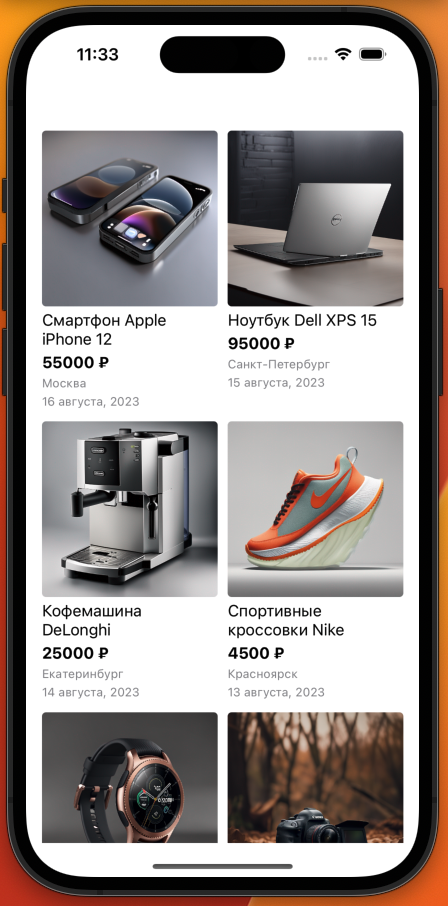
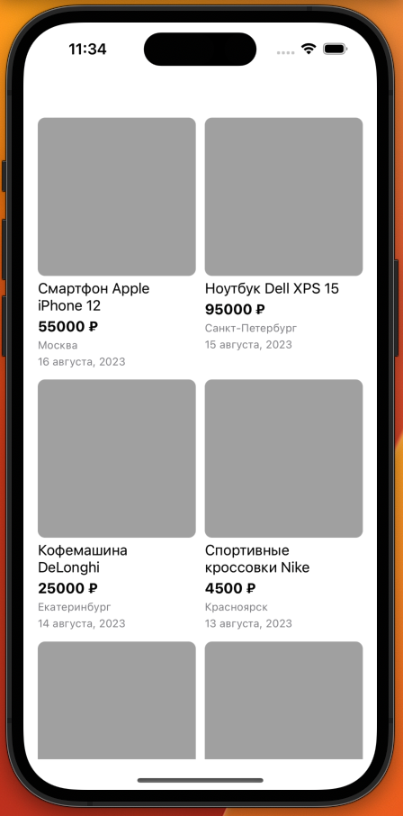
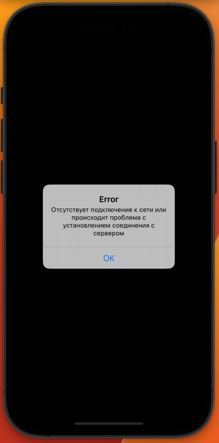
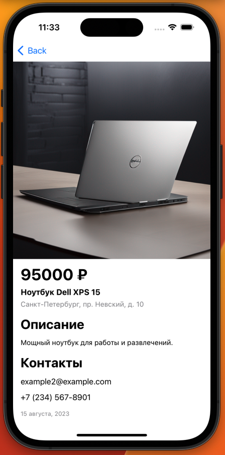
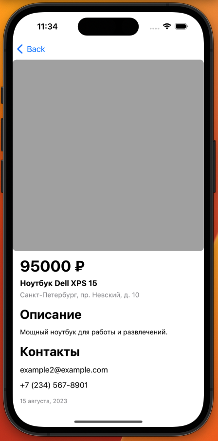
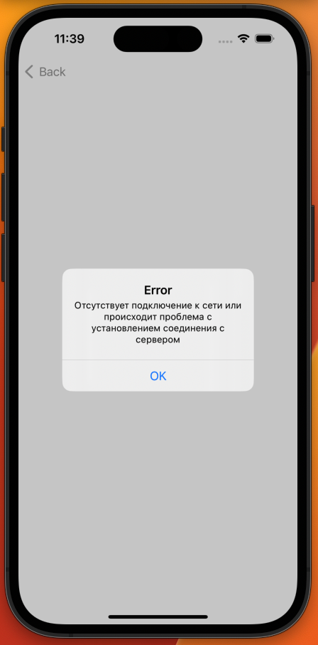

# Тестовое задание для стажёра iOS

### Инструкция по запуску
1. Двойное нажатие по Avito.xcodeproj
2. Cmd + R

### Приложение
Main Screen                |  Main screen loading      | Main screen error |
:-------------------------:|:-------------------------:|:-------------------------:|
  |   | 
**Detailed screen**                |  **Detailed screen loading**      | **Detailed screen error** |
  |   | 

### Общее описание задания:
Написать приложение для iOS, которое будет состоять из двух экранов: 
- Список товаров, данный экран будет стартовым.
- Детальная карточка товара, будет открываться по нажатию на элемент в списке товаров.

### Требование к реализации:
У каждого экрана должно быть три состояния: 
- Отображение ошибки
- Состояние загрузки
- Отображение контента из JSON файла

Внешний вид приложения реализовывается на усмотрение кандидата, за референс можно брать приложение Авито.
Для каждого экрана нужно будет загружать данные в формате JSON из интернета: 
- https://www.avito.st/s/interns-ios/main-page.json
    - URL для запроса на главном экране.
- https://www.avito.st/s/interns-ios/details/{itemId}.json
    - URL для запроса на детальной странице. ID берется из данных для главного экрана. 
    - Пример ссылки: https://www.avito.st/s/interns-ios/details/1.json

### Требования к коду:
1. Приложение написано на языке Swift. 
2. Пользовательский интерфейс приложения реализован кодом без использования SwiftUI.
3. Для отображения списка используется UICollectionView с отображением в 2 столбца.
4. Для запроса данных используется URLSession.

### Требования к сдаче результатов:
- Код должен быть выложен в git-репозиторий на [github.com](http://github.com/) и отправлен нам.
- Не забудьте сделать репозиторий публичным, чтобы мы могли его посмотреть.
